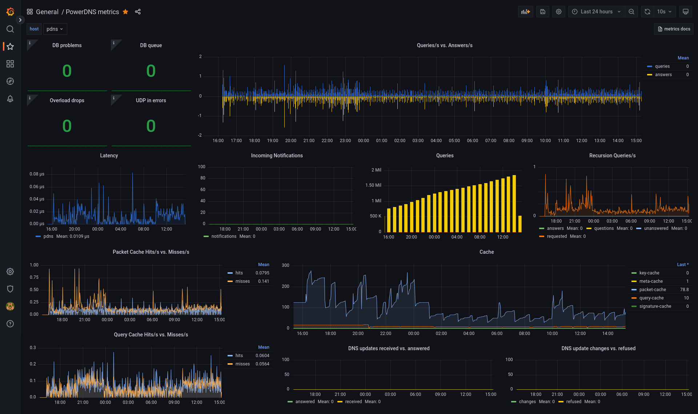
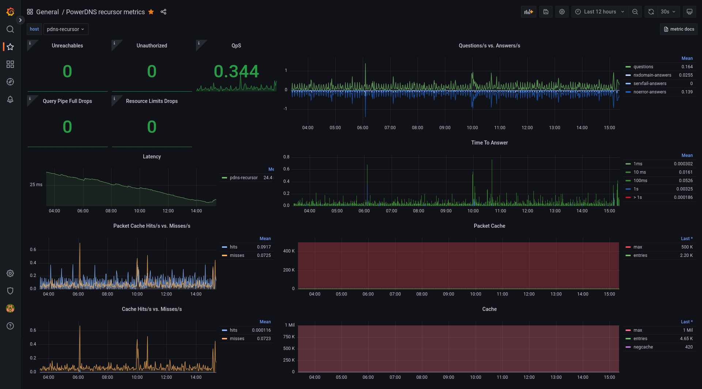
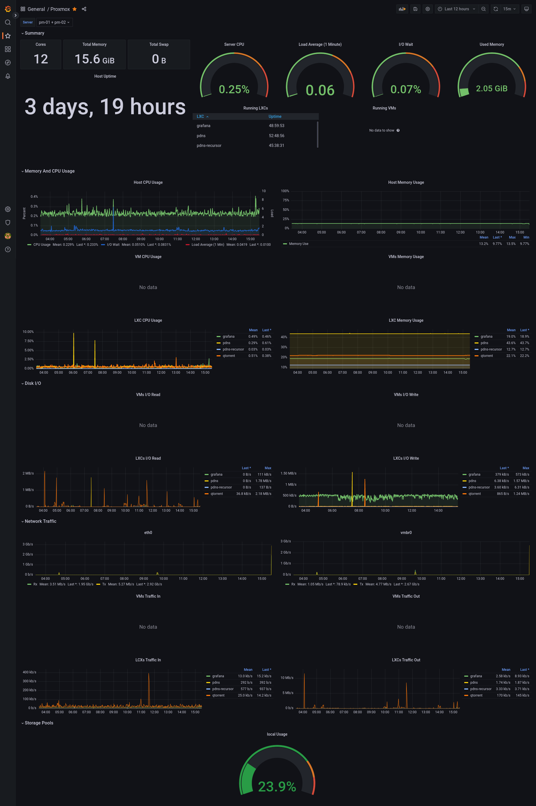
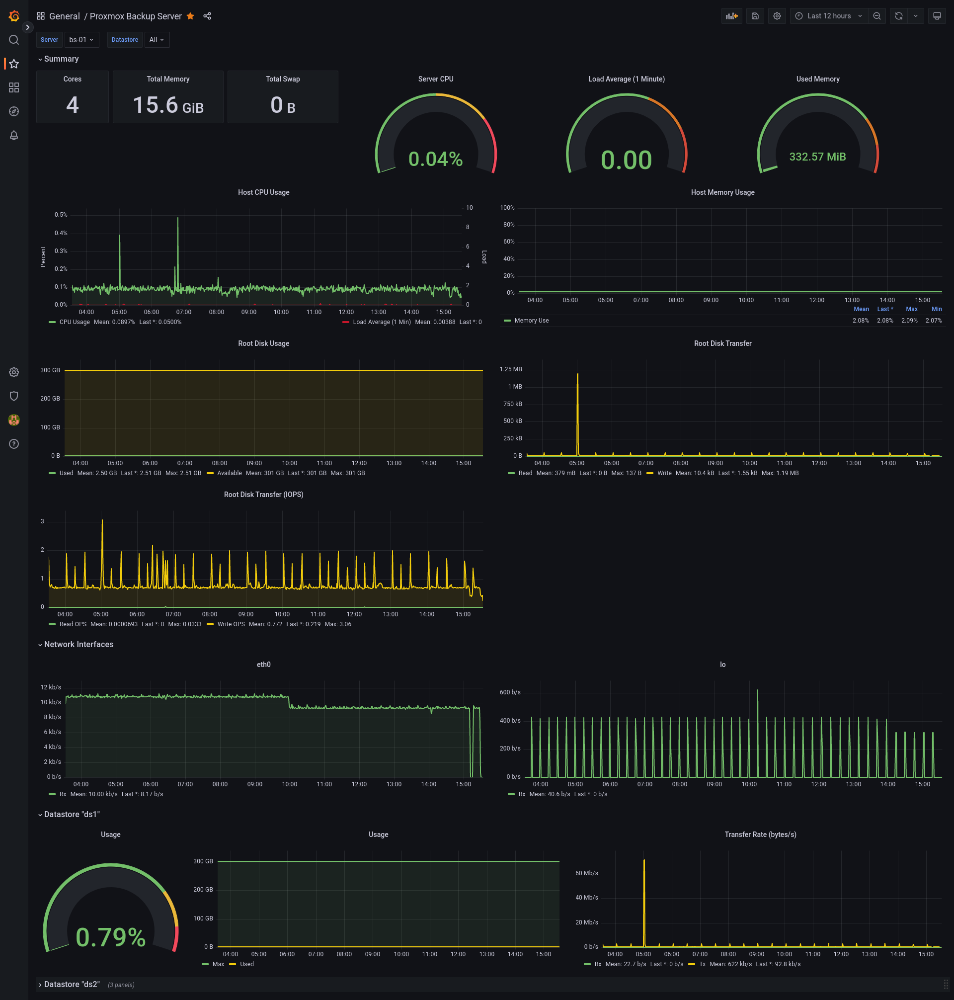

This is a random collection of Grafana Dashboard that I use internally and externally for all my monitoring purposes.

If you have any questions, please open an issue.

If you find an error, please open either an issue or feel free to submit a PR.

### PowerDNS Authority

Displays stats for your authority PowerDNS Server. Uses Graphite as a DataSource, since that can be easily setup.

### PowerDNS Recursor

Displays stats for your recursive PowerDNS Server. Uses Graphite as a DataSrouce, since that can be easily setup.

### ProxmoxVE

Displays Stats about your Proxmox Host. Does currently have network-ports and storages hard-coded.

### Proxmox Backup Server

Displays Stats about your Proxmox Backup Server. Includes auto-rows for all the Datastores that are found as well as all network-interfaces.